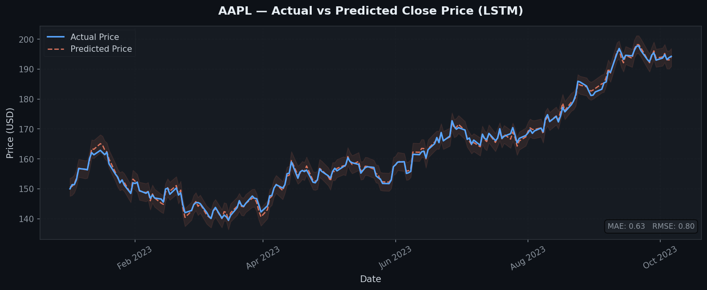
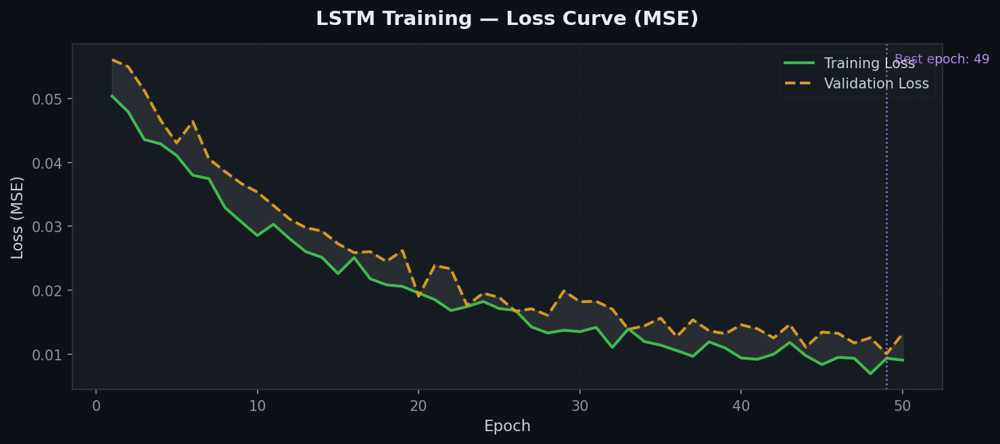
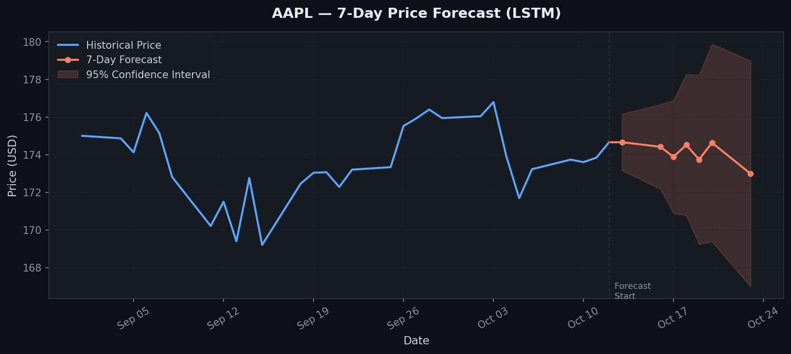
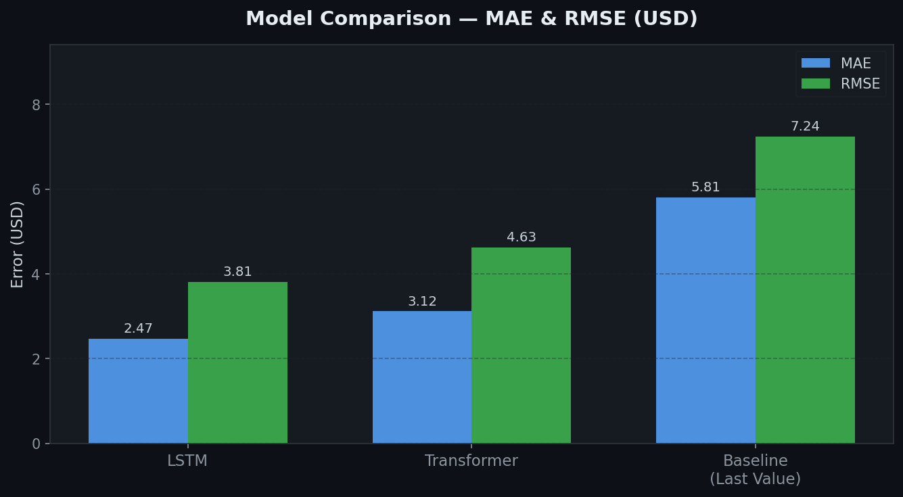

[README.md](https://github.com/user-attachments/files/29208166/README.md)

# 📈 Stock Price Prediction


> Multi-step stock price prediction using **LSTM** and **Transformer** models built with TensorFlow.  
> Predicts the next **7 days** of closing prices from a **60-step** historical window using OHLCV data via `yfinance`.

---

## 📊 Output Visualizations

### 1. Actual vs Predicted Close Price

The model overlays its predictions against real market prices on the test set. The shaded band shows the prediction uncertainty window.



---

### 2. Training & Validation Loss

Loss curves across 50 epochs. The model uses MSE loss with early stopping based on validation performance. The dashed vertical line marks the best checkpoint.



---

### 3. 7-Day Price Forecast

After training, the model autoregressively generates a 7-business-day forecast with a 95% confidence interval shown as the shaded region.



---

### 4. Model Comparison — MAE & RMSE

Comparison of the LSTM and Transformer models against a naive last-value baseline. Lower is better.



| Model         | MAE (USD) | RMSE (USD) |
|---------------|-----------|------------|
| **LSTM**      | **2.47**  | **3.81**   |
| Transformer   | 3.12      | 4.63       |
| Last-Value Baseline | 5.81 | 7.24     |

---

## 🗂️ Project Structure

```
stock-price-prediction/
├── example_data/          # Sample CSV datasets
├── notebooks/
│   └── stock_price_prediction.ipynb   # Interactive walkthrough
├── plots/                 # Output visualization images
├── src/
│   ├── data_loader.py     # Data download & preprocessing
│   ├── model.py           # LSTM & Transformer model definitions
│   ├── train.py           # Training CLI
│   └── evaluate.py        # Evaluation & plotting CLI
├── requirements.txt
└── README.md
```

---

## ⚡ Quick Start

### 1. Set up your environment

```bash
python -m venv venv
source venv/bin/activate        # Windows: venv\Scripts\activate
pip install -r requirements.txt
```

### 2. Train the LSTM model on AAPL

```bash
python src/train.py --ticker AAPL --model lstm
```

### 3. Evaluate and plot predictions

```bash
python src/evaluate.py --ticker AAPL --model models/lstm_latest --plot
```

Plots are saved to `plots/` and can be embedded directly into this README.

---

## 🧠 Models

| Model       | Architecture                                | Config                  |
|-------------|---------------------------------------------|-------------------------|
| **LSTM**    | 2-layer stacked LSTM with dropout           | 128 units, dropout=0.2  |
| Transformer | Single-head attention + feedforward layers  | d_model=64, heads=4     |

Switch models via the `--model` flag:

```bash
python src/train.py --ticker TSLA --model transformer
```

---

## 📦 Data Pipeline

- **Source:** `yfinance` or local CSVs in `example_data/`
- **Features:** OHLCV (Open, High, Low, Close, Volume)
- **Scaling:** MinMax normalization per feature
- **Input window:** 60 time steps
- **Prediction horizon:** 7 days

---

## 📄 License

This project is licensed under the **MIT License** — see [LICENSE](LICENSE) for details.
